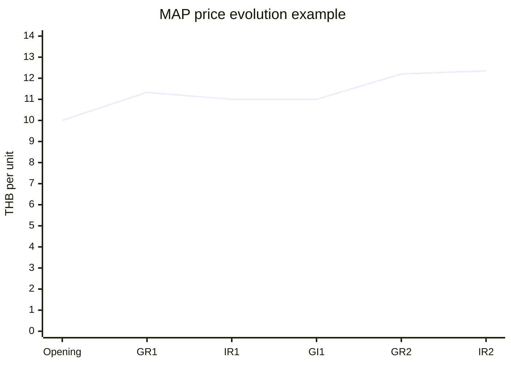
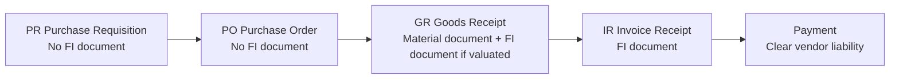
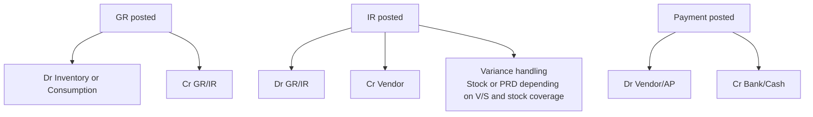

# SAP Material Master และ Stock Costing สำหรับนักพัฒนา

## บทสรุปผู้บริหาร

สำหรับนักพัฒนาที่ไม่คุ้น SAP สิ่งที่ต้องเข้าใจก่อนคือ **stock ใน SAP ไม่ใช่แค่จำนวนสินค้า** แต่เป็น **quantity + value** พร้อมกัน โดย SAP ระบุชัดว่า `Stock value = stock quantity × material valuation price` และเมื่อเกิด goods movement ที่มีผลด้านมูลค่า ระบบจะอัปเดตทั้งข้อมูล valuation ใน material master และบัญชี FI ไปพร้อมกัน ดังนั้นเวลาทีม dev บอกว่า “สต๊อกผิด” ต้องถามเสมอว่าผิดที่ **จำนวน**, **มูลค่า**, หรือ **ทั้งสองอย่าง** เพราะ root cause และจุด debug ไม่เหมือนกันเลย citeturn22view1turn22view4

สำหรับ master data จุดที่สำคัญที่สุดคือ **Accounting view** ของ material master หรือถ้าเป็น SAP Retail ก็จะอยู่ใน **article master** ที่ขยายความสามารถของ material master ให้รองรับงานค้าปลีก แต่หลักการ valuation และ FI integration ยังยึดแกนเดียวกัน วัตถุหลักที่ dev ต้องรู้คือ **valuation class**, **price control**, **valuation area**, และชนิดของ material/article เพราะทั้งหมดนี้เป็นตัวกำหนดว่า receipt, issue, return, transfer หรือ invoice variance จะไปเปลี่ยน stock value และไปลง G/L บัญชีไหน citeturn22view0turn22view1turn36search4turn36search7

หัวใจของ stock costing อยู่ที่ **price control** สองแบบ คือ **Moving Average Price, V (ราคาเฉลี่ยเคลื่อนไหว)** และ **Standard Price, S (ราคามาตรฐาน)** SAP อธิบายไว้ชัดว่า V สะท้อน **current delivered price** ส่วน S อิง **planned values** และเก็บ variance แยกไว้ใน price difference account แทนที่จะไปเปลี่ยน stock โดยตรง ดังนั้นในโลกค้าปลีก วัสดุก่อสร้าง และสินค้าซื้อมาเพื่อขายต่อ การเลือกระหว่าง V กับ S จะมีผลต่อทุกอย่างตั้งแต่ inventory valuation, margin, invoice variance, GR/IR clearing ไปจนถึง API integration และ downstream analytics citeturn29search16turn23view15turn22view2

สำหรับทีมของ Dohome ซึ่งอยู่ในบริบทธุรกิจค้าปลีก สิ่งที่คุ้มค่าที่สุดในการเรียนรู้ก่อนเรื่อง advanced costing คือ **รับเข้า-คืนของ-โอนระหว่าง DC/สาขา-ขายออก-นับสต๊อก-ปิด GR/IR** เพราะเป็น flow ที่กระทบธุรกิจประจำวันมากที่สุด ใน SAP Retail เอง SAP ก็เน้น scenario store/DC, stock in transit และ physical inventory เป็นแกนของ retail operations ดังนั้น learning path ควรเริ่มจากการ trace เอกสารและการลงบัญชีของ flow จริงก่อนค่อยต่อยอดไป Material Ledger และ edge cases เช่น negative stock หรือ backdated posting ภายหลัง citeturn36search1turn36search6turn36search10turn22view13

## แกนความเข้าใจของ Material Master และมูลค่าสต๊อก

คำว่า **Material Master** คือ master data ศูนย์กลางของสินค้า/วัตถุที่หลายโมดูลใช้ร่วมกัน เช่น Purchasing, MRP, Logistics, Sales และ Accounting ส่วนใน SAP Retail จะเรียกว่า **Article Master** และมี article categories/retail-specific data เพิ่มขึ้น แต่เมื่อมองจากฝั่ง valuation แล้ว dev ยังต้องคิดด้วย pattern เดิมคือ “master data ระดับ global + ระดับ plant/site + ระดับ storage location + valuation data” เหมือนเดิม citeturn20search5turn36search7turn20search13

ตารางต่อไปนี้สรุป **views** ที่ dev ควรเชื่อมกับปัญหา stock costing ให้ถูกจุด โดยเฉพาะ **Accounting view** ซึ่งเป็นหัวใจของ valuation และ account determination. citeturn22view1turn10search7turn10search1

| View | ระดับข้อมูล | dev ต้องสนใจเมื่อไร |
|---|---|---|
| Basic Data | ทั่วทั้ง material | ชื่อสินค้า UoM กลุ่มสินค้า คำอธิบาย |
| Purchasing | plant / purchasing relevant | PO, source determination, order unit, invoice flow |
| MRP | plant / MRP area | สงสัยว่า stock movement ถูกสร้างจาก planning เองหรือไม่ |
| Storage / Plant Data | plant และ storage location | ปัญหา stock by location, availability, on-hand mismatch |
| Accounting | valuation area | ปัญหา stock value, valuation class, price control, moving price, standard price |
| Costing | valuation / controlling | ปัญหา standard cost, target cost, ML/actual costing |

SAP ระบุว่า valuation data ใน material master ถูกควบคุมจากสองปัจจัยคือ **system setting (Customizing)** และ **material master record** เอง และ valuation area สามารถกำหนดได้ที่ระดับ **company code** หรือ **plant** ซึ่งเป็นการตั้งค่าพื้นฐานที่กลับทิศได้ยากมาก นี่สำคัญมากสำหรับ dev เพราะมันอธิบายว่าทำไม transfer บางแบบกระทบ FI แต่บางแบบไม่กระทบ และทำไม plant เดียวกันกับคนละ plant จึงถูกตีความคนละความหมายทางบัญชี citeturn22view1

ตารางสั้นนี้คือ **fields หลัก** ที่ฝั่ง dev ควรจำจาก Accounting valuation layer. ชื่อ field เป็น DDIC field มาตรฐานที่พบได้ในงาน custom code, integration mapping, และ report debugging. citeturn39search0turn40search0turn40search13

| Field | ความหมาย | แนวคิดที่ผูก |
|---|---|---|
| `MBEW-BKLAS` | Valuation Class | เลือก stock G/L/account grouping ระดับ material |
| `MBEW-BWTAR` | Valuation Type | ใช้เมื่อมี split valuation |
| `MBEW-VPRSV` | Price Control | `V` = Moving Average, `S` = Standard |
| `MBEW-VERPR` | Moving Average Price / Periodic Unit Price | ราคาปัจจุบันที่ใช้กับ V |
| `MBEW-STPRS` | Standard Price | ราคามาตรฐานที่ใช้กับ S |

นอกเหนือจาก field valuation แล้ว **material type** ยังมีผลโดยตรงต่อพฤติกรรม stock/value update และต่อ valuation classes ที่ material นั้นเลือกใช้ได้ SAP ยกตัวอย่าง material types มาตรฐานไว้เช่น raw materials, trading goods, semi-finished goods, finished products และ services ส่วน special types ที่ dev ชอบพลาดคือ **NLAG**, **UNBW**, และ **SERV**. citeturn20search1turn20search2turn22view0turn23view8

ตารางด้านล่างคือ material type patterns ที่เกี่ยวกับ retail/inventory มากที่สุด. citeturn23view8turn20search1turn20search2

| Material type pattern | ผลด้าน stock/value | ควรใช้เมื่อไร |
|---|---|---|
| Valuated stock material | มี quantity update และ value update | สินค้าคงคลังที่ต้องตีมูลค่า เช่น trading goods / raw / finished goods |
| `NLAG` | ไม่ให้ quantity update และ value update; ใช้เป็น non-stock consumption | วัสดุสิ้นเปลืองที่ซื้อบ่อยแต่ไม่เก็บเป็น stock |
| `UNBW` | มี quantity แต่ไม่มี value; ต้องมี account assignment | ของที่อยากติดตามจำนวนแต่ไม่ตีมูลค่า stock |
| `SERV` | service material แบบ lean | งานบริการ/ค่าใช้จ่ายที่ไม่ใช่ inventory item ปกติ |

สรุปแบบ developer mindset คือ: ถ้าอยากเข้าใจ stock costing ให้เริ่มจากคำถาม 4 ข้อเสมอ — **material type อะไร**, **valuation area อยู่ระดับไหน**, **price control เป็น V หรือ S**, และ **movement นี้เข้าหรือออก stock แบบ valuated หรือ consumption**. ถ้าตอบสี่ข้อนี้ไม่ได้ การ debug เรื่องต้นทุนจะเดาสุ่มแทบทั้งหมด citeturn22view1turn23view8turn23view16

## Price Control และสูตรคิดต้นทุนที่ dev ต้องเข้าใจ

SAP ระบุชัดว่า **price control** เป็นตัวกำหนดว่า inventory และ goods movement จะถูก valuate ด้วยราคาแบบใด โดยมีตัวเลือกหลักคือ **Standard Price (S)** และ **Moving Average Price (V)**. ความต่างที่สำคัญที่สุดคือ V ทำให้ material stock ใน FI สะท้อน actual prices ของ material ส่วน S จะคง stock value ไว้ที่ standard price และบันทึก variance แยกไปยัง price difference account แทน citeturn23view15turn29search16turn22view1

สำหรับ **Moving Average Price, V** SAP อธิบายว่า system จะคำนวณ material price ใหม่หลัง **goods movement**, **invoice receipt** หรือ **order settlement** และที่ goods receipt ของ PO จะ valuate ด้วย **PO price** จากนั้นที่ invoice receipt ถ้า invoice price ต่างจาก PO price ระบบจะลงส่วนต่างเข้าที่ **stock account** ถ้ามี stock coverage เพียงพอ และจะคำนวณ MAP ใหม่อีกครั้ง; แต่ถ้า stock on hand ตอนรับ invoice น้อยกว่าปริมาณ invoice ระบบจะโยนส่วนหนึ่งไปยัง **price difference account** แทน ไม่ได้ลง stock ทั้งหมด citeturn8search0turn22view2

สำหรับ **Standard Price, S** SAP ระบุว่า stock postings ทั้งหมดจะใช้ราคามาตรฐานคงที่ใน material master และถ้า goods receipt หรือ invoice receipt มีราคาต่างจาก standard price ระบบจะไปลง **price difference account (PRD)** โดย stock valuation จะไม่เปลี่ยนไปตามความต่างนั้น นอกจากนี้ SAP ยังอธิบายว่ามาตรฐานมักเชื่อมกับ standard cost estimate และสามารถ update material master ได้จากงาน costing/release price citeturn22view1turn23view15turn40search3turn40search5

ตารางเปรียบเทียบนี้สรุปแบบสั้นที่สุดในมุม dev. citeturn22view1turn22view2turn29search16turn23view15

| ประเด็น | Moving Average Price `V` | Standard Price `S` |
|---|---|---|
| แนวคิดหลัก | ให้ stock สะท้อนต้นทุนรับเข้าจริงปัจจุบัน | ให้ stock คงที่ตามราคามาตรฐาน |
| GR against PO | รับเข้าด้วย PO price | รับเข้าด้วย standard price |
| IR variance | ไปเพิ่ม/ลด stock ถ้ามี stock coverage พอ | ไป price difference account |
| stock value | เปลี่ยนตาม actual purchase/invoice | ไม่เปลี่ยนเพราะ variance |
| เหมาะกับ | purchased/trading goods ที่อยากให้ stock สะท้อนต้นทุนจริง | สินค้าที่อยากให้ valuation เสถียรและแยก variance |

### สูตรที่ใช้คิด MAP

ในกรณีปกติที่มี stock coverage เพียงพอ สูตรแกนกลางของ MAP คือ:

- **Stock Value ใหม่ = Stock Value เดิม + มูลค่าที่ลง stock ใน transaction นั้น**
- **MAP ใหม่ = Stock Value ใหม่ / Stock Quantity ใหม่**

ที่ goods receipt ของ PO, มูลค่าที่ลง stock จะเป็น `GR qty × PO price`; ที่ invoice receipt ของ V, ส่วนต่าง `(Invoice price - PO price)` จะถูกลงเพิ่ม/ลด stock ตามปริมาณที่ยังมี stock coverage และทำให้ MAP ถูกคำนวณใหม่อีกครั้ง citeturn22view2

ตารางต่อไปนี้เป็น **worked example แบบสมมติ** ที่คำนวณจาก posting logic มาตรฐานของ SAP สำหรับ V. citeturn22view2turn8search0

| Step | Qty change | มูลค่าที่ลง stock | Stock Qty | Stock Value | MAP |
|---|---:|---:|---:|---:|---:|
| Opening | – | – | 100 | 1,000.00 | 10.00 |
| GR PO 50 @ 14.00 | +50 | +700.00 | 150 | 1,700.00 | 11.33 |
| IR 50 @ 13.00 | 0 | -50.00 | 150 | 1,650.00 | 11.00 |
| GI 80 @ current MAP | -80 | -880.00 | 70 | 770.00 | 11.00 |
| GR PO 30 @ 15.00 | +30 | +450.00 | 100 | 1,220.00 | 12.20 |
| IR 30 @ 15.50 | 0 | +15.00 | 100 | 1,235.00 | 12.35 |

แผนภาพด้านล่างแสดง **วิวัฒนาการของ MAP** ตามตัวอย่างเดียวกัน ซึ่งช่วยให้ dev เห็นว่า MAP เปลี่ยนเฉพาะตอน transaction ที่กระทบมูลค่า stock จริง ไม่ได้เปลี่ยนทุกครั้งที่ quantity เปลี่ยนอย่างอิสระ. แนวคิดนี้สอดคล้องกับ SAP ที่ระบุว่าราคาใหม่ถูกคำนวณหลัง goods movement และ invoice receipt สำหรับ V. citeturn8search0turn22view2



ส่วน **worked example ของ S** จะเห็นภาพอีกแบบ คือ stock ไม่ตาม actual purchase variance แต่ไปแยกไว้ใน PRD. ตารางนี้เป็นตัวอย่างสมมติที่คำนวณจาก logic มาตรฐานของ SAP สำหรับ standard price. citeturn22view1turn22view2turn23view15

| Step | Accounting effect | Stock Qty | Stock Value | Standard Price |
|---|---|---:|---:|---:|
| Opening | – | 100 | 1,000.00 | 10.00 |
| GR PO 50 @ 14.00 | Dr Inventory 500, Dr PRD 200, Cr GR/IR 700 | 150 | 1,500.00 | 10.00 |
| IR 50 @ 13.00 | Dr GR/IR 700, Cr Vendor 650, Cr PRD 50 | 150 | 1,500.00 | 10.00 |
| GI 80 | Dr COGS/Consumption 800, Cr Inventory 800 | 70 | 700.00 | 10.00 |

ประโยคเดียวที่ควรจำคือ **V เปลี่ยน stock value ตาม actual flow; S แยก variance ออกจาก stock**. ถ้า dev เข้าใจประโยคนี้ เวลาทำ reconciliation ระหว่าง MM, FI และ analytics จะง่ายขึ้นทันที citeturn29search16turn22view1turn22view2

ใน SAP S/4HANA ยังมีเรื่องที่ควรรู้เพิ่มคือ **Material Ledger (ML)** ซึ่ง SAP ระบุว่าเป็นส่วนบังคับใน S/4HANA และมีปุ่ม **Material Price Analysis** บน Accounting tab เพื่อดู history ของ moving average price ในระดับ transactional ได้ นี่เป็นเครื่องมือสำคัญมากสำหรับการ debug price jumps, invoice variances และ backdated postings ใน production support citeturn22view9turn23view16turn23view18turn8search9

## เอกสารธุรกรรม, Movement Types, GR/IR และ Account Determination

Procure-to-Pay ของ SAP เริ่มจาก **Purchase Requisition (PR)** ไปที่ **Purchase Order (PO)** จากนั้นจึงเกิด **Goods Receipt (GR)**, **Invoice Verification / Invoice Receipt (IR)** และปิดด้วย **Payment**. SAP ระบุด้วยว่า PR และ PO ตาม flow ปกติยังไม่สร้าง FI document แต่ GR และ IR จะสร้างเอกสารทางบัญชีเมื่อ transaction นั้น accounting-relevant; ส่วน payment จะ debit vendor/AP และ credit cash/bank เพื่อ clear invoice ที่ค้างอยู่ citeturn22view13turn22view14



SAP เรียก flow หลักนี้ว่า **three-step verification** หรือการเทียบ **PO + GR + Invoice** เพื่อควบคุมทั้ง quantity และ price และใช้ **GR/IR clearing account** เป็นบัญชีพักที่ควรจะถูกเคลียร์กลับสู่ศูนย์เมื่อมีทั้ง delivery และ invoice ครบถ้วน หากไม่สมดุลแปลว่ามี discrepancy somewhere ใน flow นี้ citeturn22view13

ตารางต่อไปนี้สรุป accounting entries ระดับ concept สำหรับ flow หลัก. รูปแบบจริงอาจแตกต่างตาม price control, account assignment, tax, และ configuration. citeturn22view13turn22view14turn22view2turn22view1

| Step | เอกสาร | FI impact แบบมาตรฐาน |
|---|---|---|
| PR | Purchase Requisition | ปกติไม่มี FI document |
| PO | Purchase Order | ปกติไม่มี FI document |
| GR | Goods Receipt | Dr Inventory หรือ Consumption / Cr GR-IR |
| IR | Invoice Receipt | Dr GR-IR / Cr Vendor; อาจมี PRD หรือ stock adjustment ตาม V/S |
| Payment | Outgoing Payment | Dr Vendor/AP / Cr Bank หรือ Cash |



### Movement types ที่ต้องแม่นก่อนทำ integration หรือ report

ตารางนี้สรุป **movement types ที่เจอบ่อยในงานค้าปลีกและ inventory support** โดยความหมายของ movement types อ้างอิง SAP KBA สาธารณะ และผล FI เป็นการสังเคราะห์จาก posting logic มาตรฐานของ SAP สำหรับ BSX/WRX/PRD/GBB/COGS flow; **บัญชีจริงและ document type จริงขึ้นกับ OBYC / account grouping / SD-FI configuration**. citeturn24view1turn38view2turn22view2turn26search13turn27search19turn23view6

| Movement type | ความหมาย | ใช้เมื่อไร | ผลต่อ stock | ผลต่อ FI แบบมาตรฐาน |
|---|---|---|---|---|
| `101` | Goods receipt for purchase order | รับของเข้า stock จาก PO | +Qty, +Value ถ้า valuated | Dr Inventory / Cr GR-IR; ถ้า `S` และราคาไม่เท่ามาตรฐานจะมี PRD เพิ่ม |
| `102` | Reversal of 101 | ยกเลิก GR ที่โพสต์ผิด | -Qty, -Value | Reverse ของ 101 |
| `122` | Return delivery to vendor | คืนของให้ supplier หลัง GR | -Qty, -Value | โดยหลักคล้าย reverse ของ 101 แต่เป็น real return และอิง PO history |
| `161` | Returns PO item | PO ที่เป็น returns item | -Qty, -Value | มีผลแบบเดียวกับ 122 |
| `201` | Goods issue for cost center | เบิกใช้ภายใน เช่น store supplies | -Qty, -Value | Dr Consumption/Cost Center / Cr Inventory |
| `261` | Goods issue for order | เบิกให้ production / maintenance order | -Qty, -Value | Dr Order/Consumption / Cr Inventory |
| `311` | Storage location to storage location | ย้ายภายใน plant เดิม | +Qty/−Qty เฉพาะ location | ปกติ **ไม่มี FI document** เพราะ valuation area เดิม |
| `351` | GI for stock transport order | โอน plant-to-plant แบบ STO | ออกจาก issuing plant ไป stock in transit | มี accounting document; มูลค่าออกจาก issuing plant ไป in-transit/receiving side ตาม procedure |
| `551` | Scrapping | ตัดทิ้ง/สูญเสีย | -Qty, -Value | Dr Scrap / inventory difference / Cr Inventory |
| `601` | Goods issue for delivery | ส่งสินค้าให้ลูกค้า | -Qty, -Value | Dr COGS / Cr Inventory |

มีสอง nuance ที่ระบบ SAP เองย้ำไว้และ dev มักพลาดบ่อยมาก:

ประเด็นแรก `101` ไม่ได้แปลว่า “เข้า stock” เสมอไป เพราะ SAP ระบุว่า **ถ้า PO item มี account assignment** goods receipt จะไม่เข้า warehouse stock แต่จะ **post to consumption** ทันที ดังนั้น report หรือ interface ที่ตีความ 101 = inventory receipt เสมอ มีสิทธิ์ผิดธุรกิจได้ทันที โดยเฉพาะ NLAG, UNBW, service-like procurements หรือ consumables flows citeturn24view1turn23view8

ประเด็นที่สอง `102` กับ `122` ไม่เหมือนกันทางธุรกิจ แม้ valuation จะใกล้กัน เพราะ SAP ระบุว่า `122` ใช้แยก **real return deliveries** ออกจาก **cancellation** และ valuation ของทั้ง `102` และ `122` อ้างอิง **previous postings in PO history**. เพราะฉะนั้นถ้า integration ใช้วิธี “โพสต์ reverse ด้วย manual logic” แทนที่จะอิง original PO/history, มูลค่ามีโอกาสไม่ตรงมาตรฐาน SAP citeturn24view1turn17search1

### Valuation class และ account determination ทำงานอย่างไร

SAP อธิบาย account determination ใน MM ไว้ว่า movement ที่เกี่ยวกับบัญชีจะถูกแปลงเป็น **transaction/event keys** เช่น `BSX`, `WRX`, `PRD`, `GBB`, `KDM`, `UMB` ผ่าน **value string** ของ movement นั้น จากนั้นจึงค่อย map ไปยัง G/L accounts ตาม configuration. SAP ยังระบุชัดว่า **valuation class** ใน Accounting view ใช้เพื่อกำหนดว่า stock account ใดต้องถูก update สำหรับ material นั้น และช่วยรวม materials หลายตัวให้ใช้ stock account เดียวกันได้โดยไม่ต้องดูแลบัญชีแยกต่อ material ทุกตัว citeturn38view2turn22view0

สำหรับ dev ให้จำ logic แบบนี้:

```text
Movement Type
→ Value String
→ Transaction/Event Key เช่น BSX / WRX / PRD / GBB / KDM / UMB
→ Automatic Account Determination
→ G/L Account
```

ในทางปฏิบัติ SAP ให้ใช้ **simulation** ใน Configure Automatic Postings เพื่อตรวจสอบว่าจาก material/valuation class/plant/transaction ที่เลือก ระบบจะ resolve ไปบัญชีอะไร และ simulation นี้ถือว่ามีประโยชน์มากเพราะช่วยเห็นปัจจัยที่มีผลต่อ account determination ครบทั้ง transaction keys, valuation class, material และ plant โดยตรง citeturn38view2

ถ้าจะสรุปแบบ business-developer friendly ที่สุด:

- `BSX` = stock posting  
- `WRX` = GR/IR clearing  
- `PRD` = price difference  
- `GBB` = offsetting entry for inventory postings เช่น consumption/scrap/order issues  
- `KDM` = exchange-rate differences ในบางกรณี  
- `UMB` = revaluation gain/loss โดยเฉพาะกรณีย้อน period/price change บางแบบ citeturn38view2

## มิติองค์กรของสต๊อก, กรณียาก และสถานการณ์จริงแบบค้าปลีก

เวลาทีม dev ถามว่า “stock ตัวไหน” ใน SAP คำถามนั้นยังไม่ complete เพราะ **stock management unit** ไม่ได้ถูกระบุด้วย material อย่างเดียว แต่ SAP ใช้มิติประกอบหลายตัว เช่น **material, plant, storage location, stock type, batch/valuation type, และ special stock**. ถ้า key เหล่านี้ไม่เหมือนกัน ระบบอาจถือว่าเป็น stock คนละก้อนทันทีแม้ material number เดียวกันก็ตาม citeturn11search16turn22view15

ตารางนี้ช่วย map มิติที่ต้องเช็คก่อนจะบอกว่า “ข้อมูล stock ไม่ตรง”. citeturn22view15turn11search16turn11search6turn10search25turn11search2turn11search8

| มิติ | ใช้บอกอะไร | ผลต่อ quantity/value |
|---|---|---|
| Valuation Area | company code หรือ plant ที่ใช้ตีมูลค่า | เป็นตัวชี้ว่าการย้ายข้ามหน่วยนั้นมีผล FI หรือไม่ |
| Plant | ที่เก็บ/ใช้สินค้าในเชิงธุรกิจ | มีผลทั้ง stock, MRP, valuation ในหลายระบบ |
| Storage Location | ระดับที่ SAP จัดการ **quantity** ของ stock ปกติ | ช่วยแยก on-hand ตามคลัง/zone ภายใน plant |
| Batch | ล็อตสินค้า | เพิ่มมิติ traceability และ selection |
| Valuation Type | ใช้กับ split valuation | แยก partial stocks ให้มี valuation แยกกัน |
| Serial Number | ตัวตนรายชิ้น | SAP บันทึก plant, sloc, batch, valuation type, stock type, special stock ต่อ goods movement |
| Special Stock | stock แบบ consignment, sales order, project ฯลฯ | บางประเภทจัดการที่ plant level ไม่ใช่ storage-location level |

เรื่อง **storage location** เป็นจุดที่ dev สับสนบ่อย เพราะ SAP ระบุชัดว่า storage location คือระดับที่ stock ถูกจัดการ “โดย quantity” เป็นหลัก ขณะที่ special stocks บางประเภท เช่น customer consignment stock ถูกจัดการที่ plant level ไม่ใช่ storage location level ดังนั้น integration ที่ใช้ key แค่ `MATNR + LGORT` อาจไม่พอในหลาย scenario จริง citeturn22view15turn11search2

อีกเรื่องที่เกี่ยวกับ retail มากคือ **stock transfer ระหว่าง plant/site**. SAP แยกชัดระหว่าง transfer ใน plant เดียวกับ transfer ข้าม plant:

- **storage location → storage location ภายใน plant เดียวกัน**: ปกติไม่มี accounting document เพราะ valuation area เดิม  
- **plant → plant**: อาจกระทบ FI ถ้า plants อยู่คนละ valuation area  
- ใน retail/store replenishment แบบ **valuated stock in transit**, SAP ระบุว่า goods issue จาก DC จะสร้าง stock in transit ที่มีทั้ง quantity และ value และสร้าง accounting document ตั้งแต่ตอนออกจาก DC; ส่วน goods receipt ที่ store ถ้าไม่มี quantity differences มักเป็นแค่ transfer posting จาก in-transit ไป unrestricted stock และ **ไม่เกิด accounting document เพิ่ม** citeturn28search6turn28search2turn36search0turn36search1

นี่คือสาเหตุที่ retail integrations ระหว่าง DC กับ store มักพลาด ถ้าทีมคิดว่า “ของถึงร้านเมื่อไรค่อยมีมูลค่า” แต่ SAP two-step transfer บางแบบถือว่า **ownership/value เคลื่อนตั้งแต่ goods issue ของฝั่งส่งแล้ว**. สำหรับ Dohome ที่มีมุมมอง DC-store/store-site ชัด การทำความเข้าใจตรงนี้สำคัญกว่าทฤษฎี costing ขั้นสูงเสียอีก citeturn36search1turn36search6

### Negative stock และ backdated posting

สองเรื่องนี้คือของจริงที่ทำให้ dev support ปวดหัวที่สุด:

**Negative stock under MAP**: SAP ระบุว่าเมื่อมี negative stocks ภายใต้ moving average price ระบบจะ **switch ไปใช้ posting logic แบบ standard price** ชั่วคราว และถ้ามี posting back to previous period อาจต้องเกิด **revaluation** ใน current period ภายหลัง ดังนั้นถ้าเห็น MAP กระโดดแปลก ๆ หลัง late receipt/late invoice หรือหลัง post ย้อนวัน อย่าพยายามตีความด้วยสูตร weighted average ง่าย ๆ อย่างเดียว citeturn8search4turn29search13

**Backdated posting / previous period posting**: SAP ระบุว่าการ post goods movement ไป previous period จะทำให้ stock quantity และ stock value เปลี่ยนทั้งใน **previous period และ current period** และถ้ากรณีมาตรฐานราคาใน previous/current period ต่างกัน SAP สามารถสร้าง posting `UMB` ใน current period เพื่อทำ revaluation ของ quantity ที่ถูก post ย้อนหลังได้ citeturn29search2turn29search5turn38view2

แปลเป็นภาษาทีม dev คือ: ถ้าระบบ upstream ส่ง receipt/invoice มาช้าหรือเปิดให้ user backdate posting, การ reconcile แบบ “ดูแค่ current stock” จะไม่พอ ต้องดู **posting date, period, price control, original history, และ current-period adjustment entries** ด้วยเสมอ citeturn29search2turn38view2

### สถานการณ์จริงที่ทีมค้าปลีกควรฝึกจากเคสจริง

ตารางนี้คือสถานการณ์ที่ควรเอาไปทำ workshop กับทีม เพราะเจอบ่อยและครอบคลุม MM-FI พื้นฐานแทบทั้งหมด. citeturn24view1turn22view2turn17search1turn36search1turn26search13turn36search10

| Scenario | เอกสาร/Movement ที่เกี่ยวข้อง | จุดที่ต้องดูเป็นพิเศษ |
|---|---|---|
| รับสินค้าเข้า DC จาก vendor | PO → `101` → IR | V/S ต่างกันอย่างไร, GR/IR balance, invoice variance ลง stock หรือ PRD |
| คืนของให้ vendor | `122` หรือ PO returns `161` | แยกให้ชัดระหว่าง return กับ cancel |
| ยกเลิก GR ที่โพสต์ผิด | `102` | ต้องย้อน logic เดิมจาก PO history |
| โอน DC ไป store แบบ two-step | `351` + GR store | value move ตอน GI หรือ GR ตาม procedure ใด |
| ส่งของให้ลูกค้า | `601` | COGS/inventory, delivery timing, proof of delivery |
| Free-of-charge delivery จาก vendor | `511` | MAP material อาจมี moving price ลดลง; standard price material อาจใช้ PRD |
| Physical inventory difference | PI doc + 7xx movement category | quantity/value adjustment และ FI update |
| Late invoice / late receipt | IR หรือ GR ย้อนวัน | stock coverage, PRD, negative stock, current-period revaluation |

สำหรับ physical inventory SAP Retail ระบุชัดว่าการ post differences จะอัปเดตทั้ง **quantity-based stock**, **value-based stock**, และ **stock accounts/material ledger** ใน FI. ดังนั้นถ้า stock quantity ถูกแก้ผ่าน inventory differences แต่ custom dashboard ไม่หักมูลค่าตามด้วย แปลว่า integration model ของ dashboard ไม่ได้สะท้อน SAP truth ทั้งหมด citeturn36search10

## มุมมองนักพัฒนา, ตารางสำคัญ, BAPI ที่ควรรู้ และ checklist เวลา debug

### ตารางหลักที่ dev ควรรู้จริง

ตารางต่อไปนี้สรุป tables ที่ใช้บ่อยที่สุดสำหรับ stock costing analysis. หมายเหตุสำคัญคือใน **ECC/ERP เดิม** material documents อยู่ที่ `MKPF/MSEG` แต่ใน **S/4HANA** SAP ระบุว่ามี simplified data model ที่ใช้ **`MATDOC` single table** แทน `MKPF/MSEG` สำหรับ MM-IM; ส่วน `BKPF/BSEG` ยังเป็นหัวเอกสาร/รายการบัญชีที่ใช้ตามหน้าที่ของ FI. citeturn32search10turn32search5turn33search2turn33search5turn34search8turn35search2turn31search2

| Table | ความหมาย | ใช้ดูอะไร |
|---|---|---|
| `MARA` | General Material Data | master ระดับกลางของสินค้า |
| `MARC` | Plant Data for Material | ข้อมูลระดับ plant |
| `MARD` | Storage Location Data for Material | stock ระดับ storage location |
| `MBEW` | Material Valuation | price control, valuation class, valuation prices |
| `MATDOC` | Material documents in S/4HANA MM-IM | movement line items ฝั่งใหม่ใน S/4 |
| `MKPF` | Material document header | header ของ material doc ใน ERP/ECC |
| `MSEG` | Material document item/segment | line items ของ material doc ใน ERP/ECC |
| `EKKO` | Purchasing Document Header | PO header |
| `EKPO` | Purchasing Document Item | PO item |
| `RBKP` | Document Header: Invoice Receipt | invoice receipt header |
| `RSEG` | Document Item: Incoming Invoice | invoice receipt item |
| `BKPF` | Accounting Document Header | FI document header |
| `BSEG` | Accounting Document Segment/Items | FI line items |

อีกข้อที่สำคัญมากคือ SAP ระบุว่าถ้า goods movement เป็น accounting-relevant ระบบจะสร้าง **material document** และ **accounting document** ควบคู่กัน แต่ **document numbers มักไม่เท่ากัน**. เวลาทีมทำ trace หรือ join logs จึงไม่ควรตั้งสมมติฐานว่าเลขเอกสาร MM = FI. ต้องใช้ reference/key ที่ถูกต้องเสมอ citeturn23view5turn23view6

### BAPI และ interface ที่ควรใช้

สำหรับ integration ฝั่ง dev ควรพยายามใช้ **released BAPIs** มากกว่า internal FMs ที่ไม่ได้ release เพราะ SAP เองมี support content โดยตรงสำหรับ BAPIs หลักของ material master, purchasing, goods movement และ invoice verification และยังเตือนว่าพฤติกรรมของ BAPI อาจต่างจาก online transaction บางจุดด้วย citeturn30search22turn13search4turn12search0turn13search0turn30search26

ตารางนี้คือ shortlist ที่ practical ที่สุด. citeturn33search16turn30search0turn12search1turn30search1turn13search0turn30search26turn12search2turn30search3turn12search22

| API / Interface | ใช้ทำอะไร | หมายเหตุ dev |
|---|---|---|
| `BAPI_MATERIAL_SAVEDATA` | Create/Change material master | เหมาะกับ master data integration |
| `BAPI_MATERIAL_GET_ALL` | Read material master | ใช้อ่าน master ครบชุด |
| `BAPI_GOODSMVT_CREATE` | Post goods movement | สร้าง material document ได้ครั้งละ 1 document |
| `BAPI_GOODSMVT_CANCEL` | Reverse goods movement | ใช้ยกเลิก goods movement |
| `BAPI_PR_CREATE` | Create purchase requisition | ใช้ทำ PR จาก external system |
| `BAPI_PO_CREATE1` | Create purchase order | ฝั่ง purchasing integration มาตรฐาน |
| `BAPI_PO_CHANGE` | Change purchase order | ใช้แก้ PO |
| `BAPI_INCOMINGINVOICE_CREATE` | Post invoice receipt | ใช้แทน MIRO ใน integration |
| `BAPI_TRANSACTION_COMMIT` | Commit LUW หลังเรียก BAPI | SAP ระบุว่าควรใช้ตัวนี้ ไม่ใช่ `COMMIT WORK` ตรง ๆ |
| `MBGMCR*` IDoc | Goods movement via IDoc | ใช้ได้เมื่อ architecture ถนัด IDoc/middleware |

**Gotcha สำคัญมาก:** SAP ระบุชัดว่าถ้าเรียก BAPI อย่างน้อยหนึ่งตัวใน LUW ปัจจุบัน ควรเรียก `BAPI_TRANSACTION_COMMIT` เสมอ ไม่เช่นนั้นอาการประเภท “หน้าจอ webhook/batch job ตอบ success แต่หาเอกสารไม่เจอ” จะเกิดได้ทันที citeturn30search3

### Developer cheat sheet แบบสั้น

ตารางนี้ตั้งใจทำให้ทีม dev หยิบไปใช้ตอนอ่าน functional spec หรือ debug production ได้ทันที. ข้อมูลเป็นการสังเคราะห์จากเอกสาร SAP ที่อ้างอิงในรายงานนี้. citeturn22view1turn22view2turn38view2turn24view1turn33search5turn32search10

| ถ้าสงสัยเรื่อง… | ให้เช็คก่อน | ที่ดู |
|---|---|---|
| stock value แปลก | `VPRSV`, valuation class, valuation area | `MBEW`, Accounting view |
| on-hand by location ไม่ตรง | plant + sloc + stock type + special stock | `MARD`, movement docs |
| GR เข้า stock หรือเข้า consumption | PO account assignment, material type | `EKPO`, movement `101`, material type |
| invoice variance ลง stock หรือ PRD | price control + stock coverage ตอน IR | `RBKP/RSEG`, `MBEW`, PO history |
| transfer มี/ไม่มี FI | transfer within same plant หรือ across valuation area | `311` vs plant transfer / STO |
| delivery ตัดต้นทุนยังไง | movement `601`, COGS posting, inventory credit | delivery flow + `BKPF/BSEG` |
| S/4 custom code อ่าน doc ไหน | ใช้ `MATDOC` เป็นหลักสำหรับ MM-IM | `MATDOC` และ FI docs |
| MM doc กับ FI doc คนละเลข | อย่า join ด้วยเลขเดียวกัน | ใช้ reference/key ที่ถูกต้อง |

### Troubleshooting checklist สำหรับ timing และ async/integration issues

ตารางนี้คือ checklist ที่ใช้แกะ incident ได้เร็วที่สุด โดยผูกกับกลไกมาตรฐาน SAP จริง. citeturn23view5turn28search6turn28search2turn22view2turn5search16turn29search2turn38view2turn17search1turn30search3turn30search22turn22view13turn33search5

| อาการ | root cause ที่พบบ่อย | จุดตรวจ |
|---|---|---|
| Material doc มี แต่ FI doc ไม่มี | movement ไม่ accounting-relevant หรือเป็น transfer ภายใน valuation area เดิม | movement type, valuation area, stock transfer pattern |
| GR เข้าแล้ว stock value ไม่เป็นไปตาม PO | material เป็น `S` หรือมี account assignment ทำให้เข้า consumption | `MBEW-VPRSV`, `EKPO`, movement `101` |
| Invoice variance ไม่ไปลง stock | stock coverage ไม่พอในตอน IR หรือ material ใช้ standard price | stock on hand ตอน IR, `VPRSV`, PO/IR difference |
| MAP เปลี่ยน แต่ downstream ไม่รู้ | change pointer ของ `MBEW-VERPR` จาก GR/IR อาจไม่ถูกสร้าง | อย่าพึ่งพา change pointer อย่างเดียว; ดู material docs / price analysis |
| post ย้อนวันแล้ว current period เพี้ยน | previous-period posting / revaluation / `UMB` adjustment | posting date, period, backdated GR/IR |
| Return/Reverse มูลค่าไม่เท่าที่คาด | `102/122` ใช้ valuation ตาม PO history ไม่ใช่คำนวณใหม่แบบอิสระ | PO history, original document chain |
| interface บอก success แต่หาเอกสารไม่เจอ | ลืม `BAPI_TRANSACTION_COMMIT` หรือเจอ difference between BAPI and online process | LUW, commit, BAPI return table |
| GR/IR balance ไม่ zerout | ยังไม่มีคู่เอกสารครบ หรือ quantity/price ไม่ match กัน | `EKKO/EKPO`, `RBKP/RSEG`, GR/IR maintenance |
| custom report อ่าน `MKPF/MSEG` แล้วข้อมูลหาย | ระบบเป็น S/4HANA ที่ใช้ `MATDOC` แล้ว | data model ของระบบปัจจุบัน |

มีอีกประเด็นที่ “ไม่เกี่ยวกับ costing โดยตรงแต่สำคัญมาก” คือ SAP มี KBA ว่าการเปลี่ยนค่า **moving average price (`MBEW-VERPR`)** จาก GR/IR อาจ **ไม่ถูก capture ใน change pointers** แม้เปลี่ยนจริง ซึ่งแปลว่าถ้าทีมทำ outbound integration หรือ CDC โดยดูเฉพาะ material master change pointers downstream system อาจ “ไม่เห็น” การเปลี่ยนต้นทุน stock เลย ทั้งที่ valuation เปลี่ยนไปแล้วจริง วิธีที่มั่นคงกว่าคืออ่านจาก **material documents / MATDOC / price analysis** หรือออกแบบ event model ให้ผูกกับ transaction flow แทน citeturn5search16turn22view9

สำหรับทีม support ควร bookmark official SAP references สองชุด คือ KBA index ฝั่ง **Procurement - Inventory Management** และ **Procurement - Invoice Verification** เพราะ SAP รวม note/KBA ที่ใช้ debug พฤติกรรมมาตรฐานไว้เป็นรายการใหญ่แล้ว ช่วยลดเวลาคลำทางเองได้มาก citeturn5search14turn5search19

## แนวทางยกระดับความเข้าใจของทีม Dohome

ถ้าจัดลำดับการเรียนรู้แบบได้ผลเร็วที่สุดสำหรับทีม dev ในบริษัทค้าปลีก ลำดับที่แนะนำคือเริ่มจาก **transaction truth ก่อน customizing depth**. เหตุผลคือ SAP Learning เองจัดเนื้อหา foundation ไว้เป็นลำดับจาก material master → inventory management → procure-to-pay → account determination → retail site/store flows และจากประสบการณ์เชิงสถาปัตยกรรม ปัญหาของ dev ส่วนใหญ่ไม่ได้พลาดเพราะไม่รู้ OBYC แต่พลาดเพราะ trace เอกสารไม่เป็นและไม่รู้ว่า movement ใดกระทบ quantity หรือ value ที่ชั้นไหน citeturn22view1turn22view13turn38view2turn36search1turn36search7

ตารางนี้คือ **prioritized learning path** ที่เหมาะกับทีม Dohome. เป็นข้อเสนอเชิงสังเคราะห์จากเอกสาร SAP และบริบทร้านค้า/คลัง/DC ของธุรกิจค้าปลีก. citeturn22view1turn22view13turn36search1turn36search6turn36search10turn38view2

| Priority | สิ่งที่ต้องเรียนก่อน | ผลลัพธ์ที่อยากได้ |
|---|---|---|
| Foundation | stock = quantity + value, valuation area, storage location, Accounting view | อ่าน incident ได้ถูกชั้น ไม่สับสน MM กับ FI |
| Core transaction | `101`, `102`, `122`, `201`, `311`, `351`, `551`, `601` | trace flow ประจำวันได้ |
| Procure-to-pay | PR → PO → GR → IR → Payment, GR/IR, invoice variance | reconcile PO history กับ FI ได้ |
| Retail operations | DC → store transfer, stock in transit, store receipt, physical inventory | เข้าใจ flow ของค้าปลีกจริง |
| Dev data & APIs | `MARA/MARC/MARD/MBEW`, `MATDOC`, `BKPF/BSEG`, BAPIs + commit | ทำ integration/report/custom code ได้ไม่หลง data model |
| Advanced | Material Ledger, price analysis, negative stock, backdated posting, split valuation | รับมือเคสยากและ period-end issues ได้ |

ตารางฝึกอบรมด้านล่างเป็น **training outline 5 sessions** สำหรับทีม dev/BA/support ผสมกัน โดยตั้งใจให้แต่ละ session ต้องมีทั้ง concept และ hands-on exercise เสมอ. citeturn22view1turn22view2turn22view13turn38view2turn36search1turn36search10

| Session | เป้าหมาย | Exercise |
|---|---|---|
| Material Master และ stock as quantity + value | ให้ทุกคนเห็นว่า stock เก็บทั้ง quantity กับ value และรู้ว่าต้องเปิด view ไหนดู field อะไร | เลือก material 1 ตัว แล้ว trace `MARA → MARC → MARD → MBEW` พร้อมอธิบายว่า field ไหนคุม valuation |
| Price control V/S | ให้ทีมคำนวณต้นทุนจาก transaction จริงได้ | ทำตัวอย่าง MAP และ Standard จาก PO → GR → IR → GI แล้วเปรียบเทียบ stock value กับ PRD |
| Movement types และ account determination | แยกให้ได้ว่า movement ไหนเข้า stock, consumption, transfer, return, delivery | จำลอง `101`, `102`, `122`, `201`, `311`, `601` แล้วเขียน expected FI entries ก่อนค่อยเช็คระบบ |
| GR/IR และ invoice variance | ให้เข้าใจ open GR/IR, three-way match, partial invoice, late invoice | เอา PO จริง 1 ใบมา reconcile quantity/value ระหว่าง PO history, invoice, GR/IR, vendor balance |
| Retail flows และ debugging | ผูกความรู้ SAP มาตรฐานกับของจริงแบบ Dohome | ฝึกเคส DC → store transfer, physical inventory difference, และ incident debug จาก material doc/FI doc/API log |

ถ้าจะให้เลือก “สิ่งเดียวที่ทีมควรทำในเดือนแรก” ผมแนะนำให้ทำ **cross-functional workshop** ที่เอา material จริง 3 ตัวของ Dohome มาตาม trace แบบครบ chain:

- ตัวแรกเป็นสินค้าซื้อมาเพื่อขายต่อที่ใช้ `V`  
- ตัวที่สองเป็นสินค้าที่ใช้ `S`  
- ตัวที่สามเป็น consumable/non-stock flow (`NLAG`/`UNBW` pattern)  

แล้วให้ทีมตอบให้ได้ว่าแต่ละตัว **อยู่ table ไหน**, **movement ไหน**, **เข้าสต๊อกหรือเข้า consumption**, **ลง FI อย่างไร**, และ **invoice variance ไปบัญชีไหน**. ถ้าทีมตอบได้ครบสามตัวนี้ ความเข้าใจเรื่อง stock costing ใน SAP จะกระโดดขึ้นอย่างมีนัยสำคัญทันที เพราะได้เชื่อม master data, transaction data, account determination และ business process เข้าด้วยกันครบวงจร citeturn23view8turn22view1turn22view2turn38view2