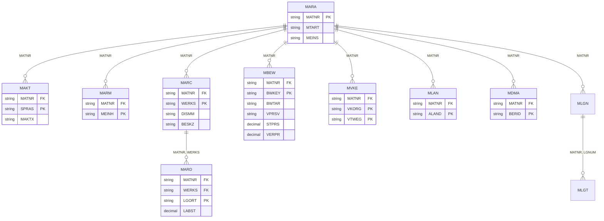
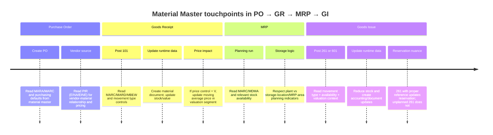

# หลักการทำงานของ Material Master ใน SAP สำหรับใช้สอนทีม Development

## Executive Summary

Material Master คือ business object กลางของ SAP Logistics ที่เก็บข้อมูลอ้างอิงของสินค้า/วัสดุ/ผลิตภัณฑ์ไว้แบบรวมศูนย์เพื่อให้ Purchasing, Inventory Management, Invoice Verification, Sales, MRP และงานด้านการผลิตใช้ร่วมกันได้ โดย SAP อธิบายมันว่าเป็น **central repository of information on materials** และการรวมข้อมูลไว้ในวัตถุเดียวช่วยลด data redundancy; ในเชิงสถาปัตยกรรมจึงมองได้ว่า Material Master ทำหน้าที่เป็น **Single Source of Truth** ทางธุรกิจ แม้ในเชิง physical storage จะไม่ได้อยู่ในตารางเดียว แต่แตกเป็นหลาย segments/tables ตาม organizational level และ functional view. citeturn6search0turn6search2turn11search3

สำหรับทีม Development ประเด็นที่สำคัญที่สุดไม่ใช่แค่ “รู้ว่าตารางไหนเก็บอะไร” แต่ต้องเข้าใจว่า **key ของข้อมูลขึ้นกับ organizational level** เช่น MARA อยู่ระดับ client, MARC อยู่ระดับ plant, MARD อยู่ระดับ storage location, MBEW อยู่ระดับ valuation area, MVKE อยู่ระดับ sales organization/distribution channel และ MLAN อยู่ระดับประเทศภาษี ดังนั้น bug ที่พบบ่อยจึงมาจากการอ่านข้อมูลโดยใส่ key ไม่ครบ, hardcode ว่า valuation area = plant เสมอ, หรือเอา stock table ไปใช้เสมือนเป็น master data table โดยไม่คำนึงถึง S/4HANA data model. citeturn0search0turn5search5turn14search7turn14search9turn8search0

ในเชิงบัญชีและต้นทุน Material Master เชื่อมกับ FI ผ่าน valuation structure ซึ่งประกอบด้วย valuation area, valuation class, valuation category/type, material type และ movement type; ส่วนผลทางบัญชีจริงเกิดจาก combination ของ price control (V/S), valuation class และ automatic account determination เช่น BSX, WRX, GBB, PRD จึงเป็นเหตุผลว่าทำไม dev ที่ debug issue ฝั่ง MM/FI ต้องอ่านทั้ง master, movement และ customizing ไปพร้อมกัน. citeturn27search3turn27search4turn2search6turn2search9turn3search2turn24search4

## ขอบเขตและข้อสมมติ

รายงานนี้สมมติว่า **ระบบยังไม่ได้ระบุชัดว่าเป็น SAP ECC หรือ SAP S/4HANA** จึงใช้มุมมอง “generic SAP ERP/S/4HANA” เพื่อสอนหลักการร่วม โดยยังอ้างอิงตาราง classic หลักอย่าง MARA, MARC, MARD, MBEW, MVKE, MLAN ฯลฯ เพราะตารางเหล่านี้ยังเป็นโครงสร้างสำคัญของ Material Master อยู่ อย่างไรก็ดี สำหรับ S/4HANA ฝั่ง Inventory Management มี **New Simplified Data Model** ที่ย้าย document line item ไปไว้ใน MATDOC และทำให้ stock figures ใน hybrid tables อย่าง MARD/MARC คำนวณแบบ on-the-fly ผ่าน CDS/aggregation มากขึ้น ดังนั้นเวลาอธิบายทีมควรแยกให้ชัดระหว่าง “logical table model” กับ “runtime persistence model”. citeturn8search0turn8search8

อีกข้อสมมติหนึ่งคือรายงานนี้เน้น **developer-facing teaching content** ไม่ได้ลงรายละเอียด configuration ทุก node ใน IMG แต่จะชี้ให้เห็นว่าจุดใดเป็น responsibility ของ Functional/Config และจุดใดที่ Dev ต้อง respect ในการอ่าน/เขียนข้อมูล เช่น valuation level, material type attributes, movement type behavior และ official write interfaces อย่าง BAPI/API สำหรับ Product/Material Master. citeturn27search3turn9search0turn9search1

## แนวคิดและแบบจำลองข้อมูล

Material Master ไม่ใช่ “หนึ่งตารางหนึ่งสินค้า” แต่เป็น **logical master record** ที่ SAP แยกเก็บเป็นหลาย data segments ตามหน้าที่ของแผนกและระดับองค์กร ตัวอย่างเช่นข้อมูลทั่วไปเก็บใน MARA, คำอธิบายหลายภาษาเก็บใน MAKT, หน่วยนับเพิ่มเติมเก็บใน MARM, ข้อมูลโรงงานเก็บใน MARC, ข้อมูลคลังย่อยเก็บใน MARD, ข้อมูลการตีมูลค่าเก็บใน MBEW, ข้อมูลการขายเก็บใน MVKE, และข้อมูลภาษีระดับประเทศเก็บใน MLAN. แนวคิด “single record, multiple segments” นี้คือหัวใจที่ต้องทำให้ทีม dev เข้าใจตั้งแต่ต้น เพราะเวลาทำ query หรือออกแบบ interface ต้องรู้ว่าข้อมูลแต่ละ field มี scope ไหน. citeturn0search0turn5search5turn5search0

ความสัมพันธ์เชิงลอจิกของตารางหลักสามารถสรุปเป็น ER แบบสอนทีมได้ดังนี้ โดย diagram นี้เป็น **logical ER** เพื่อใช้สอน key relationships ไม่ใช่ complete DDIC ของทุก field. คีย์หลักและระดับการผูกกันอิงตาม SAP Help ของ Material Master Data Structures และ Sales data structure. citeturn0search0turn5search0turn5search5



ตารางด้านล่างเป็น quick comparison ระหว่างตารางกับ data scope ที่ทีม Development ควรจำให้แม่นก่อนเขียน SELECT/JOIN ใด ๆ โดยเฉพาะ MBEW และ MARD ซึ่งมักถูกเข้าใจผิดบ่อยที่สุด. ที่มาสรุปจาก SAP Help Material Master Data Structures, Stock Tables and Stock Types และ Sales structure documentation. citeturn0search0turn5search5turn7search0turn5search0

| Table | บทบาทหลัก | Scope หลัก | Key ที่สำคัญต่อ Dev |
|---|---|---|---|
| MARA | General Material Data | Client | `MATNR` |
| MAKT | Material Description | Language-dependent | `MATNR + SPRAS` |
| MARM | Additional Units of Measure | UoM segment | `MATNR + MEINH` |
| MARC | Plant Data | Plant | `MATNR + WERKS` |
| MARD | Storage Location Data และ stock-facing segment | Storage Location | `MATNR + WERKS + LGORT` |
| MBEW | Valuation Data | Valuation Area | `MATNR + BWKEY (+ BWTAR ถ้า split valuation)` |
| MVKE | Sales Data | Sales Org / Distribution Channel | `MATNR + VKORG + VTWEG` |
| MLAN | Tax Classification | Country | `MATNR + ALAND` |
| MDMA | MRP Area Data | MRP Area | `MATNR + BERID` |
| MLGN / MLGT | WM data | Warehouse Number / Storage Type | `MATNR + LGNUM`, `MATNR + LGNUM + LGTYP` |

Material Type (ประเภทวัสดุ/สินค้า) เป็น control object สำคัญ เพราะมันกำหนด screen sequence, field selection, number range, departmental views ที่ maintain ได้, procurement characteristics และร่วมกับ plant มีผลต่อ quantity/value update และบัญชีที่เกี่ยวข้องเมื่อมี goods movement. นอกจากนี้ในมุม valuation วัสดุ type ยังเป็นต้นทางของ account category reference ที่ใช้ควบคุม valuation classes ที่เลือกได้ ถ้าไม่มี valuation type มา override. citeturn29search8turn27search3turn27search4turn1search4

ตารางเปรียบเทียบต่อไปนี้ใช้ “standard meaning” ของ material types เพื่อสอนทีม และควรย้ำว่า **implementation จริงอาจถูกปรับใน Customizing**. citeturn29search1turn29search2turn29search8

| Material Type | ความหมายมาตรฐาน | Dev impact ที่มักเจอ |
|---|---|---|
| ROH Raw Materials | วัตถุดิบที่จัดหาจากภายนอกแล้วนำไปแปรรูป | มักต้องอ่าน Purchasing + MRP + Accounting; โดยมาตรฐานไม่เน้น Sales data |
| HALB Semifinished Products | วัสดุกึ่งสำเร็จรูปที่อาจจัดหาภายนอกหรือผลิตเอง | ต้องดูทั้ง Purchasing, Work Scheduling/MRP, Accounting |
| FERT Finished Products | สินค้าสำเร็จรูปที่บริษัทผลิตเอง | มักเกี่ยวกับ Sales + MRP + Accounting + Costing |
| HAWA Trading Goods | สินค้าที่ซื้อมาแล้วขายต่อ | ต้องสนใจ Purchasing + Sales พร้อมกัน และผลทางบัญชีจาก stock/COGS |
| SERV Service | บริการที่ไม่ stockable/non-transportable | logic สต็อกและ inventory management ไม่ใช่ use case หลัก |

สุดท้ายเรื่อง **View (มุมมองข้อมูล)** ต้องสอนให้ทีมเข้าใจว่า view ใน MM01/MM02 เป็นการจัด field ตามหน้าที่ของแผนก ไม่ได้แปลว่า “หนึ่ง view = หนึ่ง table” เสมอไป และเมื่อเลือก views แล้วระบบจะถามเฉพาะ organizational levels ที่เกี่ยวข้องกับ views นั้น ๆ. citeturn1search6turn6search5

## ระดับองค์กรและรูปแบบการเข้าถึงข้อมูล

Core rule ที่ต้องปลูกฝังทีมคือ “**อย่า query Material Master โดยดูแค่ MATNR**” เพราะข้อมูลจำนวนมากไม่ได้อยู่ระดับ global เท่านั้น SAP อธิบาย Material Master ว่ามีโครงสร้างแบบ hierarchical organization ตั้งแต่ client ลงไปถึง company code, plant, storage location และยังมี sales organization, distribution channel, warehouse number, storage type และ valuation area สำหรับบางมุมมองด้วย. citeturn14search1turn14search6turn14search7

ในงาน MM/IM ปกติ business transaction ทำงานหลักที่ระดับ **plant และ storage location**; เมื่อ post goods movement ผู้ใช้ใส่ plant/storage location และระบบ derive company code จาก plant ผ่าน valuation area. แต่การตีมูลค่าไม่จำเป็นต้องเกิดที่ plant เสมอไป เพราะ valuation area สามารถ configure ได้ทั้งระดับ **plant หรือ company code** ดังนั้น code ที่ hardcode `MBEW-BWKEY = WERKS` จะถูกต้องเฉพาะระบบที่ valuation level ตั้งเป็น plant เท่านั้น. citeturn14search10turn14search2turn14search9turn14search11

ผลกระทบต่อการอ่าน/เขียนข้อมูลคือ ถ้าเลือก view ที่เป็น plant data ระบบจะ maintain segment ระดับ MARC; ถ้าเพิ่ม storage location system จะ maintain MARD; ถ้าเข้า accounting/valuation จะ maintain MBEW ตาม valuation area; ถ้าเข้า sales จะ maintain MVKE ที่ระดับ sales org/distribution channel และบาง sales/plant data ต้องอาศัย plant เพิ่มเติมด้วย. ในงานเขียนข้อมูล SAP เองเตรียม official interfaces เช่น `BAPI_MATERIAL_SAVEDATA`, `BAPI_MATERIAL_GET_DETAIL` และใน S/4HANA มี Product Master API (`API_PRODUCT_SRV`) เพื่อทำ CRUD อย่างเป็นทางการ. citeturn5search0turn5search2turn15search10turn9search0turn9search1turn9search7

ตัวอย่าง SQL pseudocode ด้านล่างตั้งใจสอนสองเรื่องพร้อมกัน คือ **full key selection** และ **valuation-area awareness**. ถ้าระบบใช้ plant-level valuation สามารถ map `BWKEY = WERKS`; ถ้าใช้ company-code valuation ต้อง resolve `BWKEY` จาก customizing/plant assignment ก่อน. citeturn14search2turn14search9turn14search10

```sql
-- Pseudo-SQL: read one material with plant + valuation context
SELECT
    a.MATNR,
    a.MTART,
    a.MEINS,
    c.WERKS,
    c.DISMM,      -- MRP Type
    c.BESKZ,      -- Procurement Type
    d.LGORT,
    d.LABST,      -- stock-facing field; hybrid in S/4HANA
    b.BWKEY,
    b.BWTAR,
    b.VPRSV,      -- Price Control (V/S)
    b.STPRS,      -- Standard Price
    b.VERPR,      -- Moving Average Price
    v.VKORG,
    v.VTWEG
FROM MARA a
JOIN MARC c
  ON c.MATNR = a.MATNR
LEFT JOIN MARD d
  ON d.MATNR = c.MATNR
 AND d.WERKS = c.WERKS
 AND d.LGORT = :p_lgort
LEFT JOIN MBEW b
  ON b.MATNR = a.MATNR
 AND b.BWKEY = :p_bwkey      -- อย่า hardcode = WERKS ถ้ายังไม่รู้ valuation level
LEFT JOIN MVKE v
  ON v.MATNR = a.MATNR
 AND v.VKORG = :p_vkorg
 AND v.VTWEG = :p_vtweg
WHERE a.MATNR = :p_matnr
  AND c.WERKS = :p_werks;
```

ABAP pseudocode แบบ developer-friendly ที่แนะนำคือแยก read เป็น segment ตาม organizational key แทนการ `SELECT *` ยาว ๆ แล้วค่อยเดา scope ภายหลัง และถ้าจะเขียนข้อมูลให้ใช้ BAPI/API มากกว่าการ update table ตรง. citeturn9search0turn9search1turn9search11

```abap
" Pseudo-ABAP: read by material + plant + valuation area
DATA: ls_mara TYPE mara,
      ls_marc TYPE marc,
      ls_mbew TYPE mbew,
      lv_bwkey TYPE bwkey.

SELECT SINGLE * FROM mara
  WHERE matnr = @iv_matnr
  INTO @ls_mara.

SELECT SINGLE * FROM marc
  WHERE matnr = @iv_matnr
    AND werks = @iv_werks
  INTO @ls_marc.

" Resolve valuation area first:
" - plant-level valuation  -> BWKEY = WERKS
" - company-code valuation -> BWKEY = plant's company-code valuation area
lv_bwkey = zcl_mm_org=>resolve_bwkey( iv_werks = iv_werks ).

SELECT SINGLE * FROM mbew
  WHERE matnr = @iv_matnr
    AND bwkey = @lv_bwkey
    AND bwtar = @iv_bwtar   " optional for split valuation
  INTO @ls_mbew.

IF ls_mbew-vprsv = 'V'.
  rv_effective_price = ls_mbew-verpr.
ELSEIF ls_mbew-vprsv = 'S'.
  rv_effective_price = ls_mbew-stprs.
ENDIF.
```

## กระบวนการตัวอย่างและเส้นแบ่งระหว่าง Master กับ Stock

เพื่อใช้สอนทีมให้เห็น “touchpoints” ระหว่าง transaction กับ master data รายงานนี้จัด sequence ตามโจทย์คือ **PO → GR → MRP → GI** แม้ในธุรกิจจริง MRP มักเป็นตัวมาก่อน PO ก็ตาม แนวคิดสำคัญคือเอกสาร transaction ส่วนใหญ่ **อ่าน** Material Master เพื่อหา default/configuration และจะ **เขียนกลับ** เฉพาะบาง segments เช่น valuation/stock aggregates ในบางกรณี มากกว่าจะเปลี่ยนข้อมูล general master ทั่วไป. สาระนี้สอดคล้องกับ SAP docs ที่แยก material master maintenance ออกจาก goods movement processing และระบุว่า movement type เป็นตัวควบคุม quantity/value/account updates. citeturn6search5turn20search9turn18search6

ในมุม Purchasing, material master ให้ข้อมูลเช่น order unit, purchasing group, tolerances และเชื่อมต่อกับ Purchasing Info Record ซึ่งเป็นความสัมพันธ์ระหว่าง material กับ vendor; PIR เก็บราคาปัจจุบัน เงื่อนไข และ planned delivery time และอาจอยู่ระดับ purchasing organization หรือ plant. ดังนั้นตอนสร้าง PO ระบบอ่าน material master และ PIR เป็นหลัก. citeturn15search7turn15search2turn15search1

ตอน Goods Receipt (เช่น movement type 101) ระบบอ่าน material/plant/storage/valuation data เพื่ออัปเดต quantity, value และ document; goods movements เป็นเหตุการณ์ที่ SAP ระบุว่ามีผลต่อ quantity fields, stock/material valuation และ consumption accounts ตาม movement type ที่ใช้. สำหรับวัสดุที่ใช้ moving average price ระบบจะ recalculation ราคาใน material master valuation segment หลัง GR/IR ตาม inventory value ÷ stock quantity. citeturn20search9turn18search10turn13view6turn4search0

ตอน MRP ข้อมูลหลักที่อ่านมาจาก Material Master คือ plant-level MRP data และถ้าจะใช้ storage location MRP หรือ MRP area ก็ต้องมี segment/indicator ที่เหมาะสมใน material master; SAP ระบุชัดว่าการวางแผนปกติทำที่ plant level และหากจะ include/exclude storage location จริง ๆ ต้องดูค่าที่ material master เช่น `MARD-DISKZ` ไม่ใช่คาดเดาจาก OMIR อย่างเดียว. ที่สำคัญ OMIR เป็น default สำหรับ record ใหม่และ **ไม่ update ย้อนหลัง** ให้ existing materials อัตโนมัติ. citeturn6search1turn16search0turn16search1turn16search10

ตอน Goods Issue (GI) เส้นแบ่งที่ dev ต้องรู้คือ planned vs unplanned posting โดยเฉพาะ movement 261 หาก post แบบ reference ไปที่ order/reservation ระบบจะ update reservation/order context; แต่ถ้า post โดยใส่ order เป็นแค่ account assignment object ระบบจะมองเป็น unplanned goods issue และ reservation จะไม่ถูก update. ส่วน GI สำหรับ outbound delivery ใช้ movement 601 ใน flow มาตรฐานของ shipping/delivery. citeturn21search1turn18search5turn19search5

ภาพรวมการแตะ read/write points สามารถสอนทีมด้วย timeline นี้: citeturn15search2turn15search1turn18search10turn16search0turn21search1turn19search5turn8search0



หัวข้อที่คนสับสนบ่อยคือ **Stock vs Master**. คำตอบสั้นคือ “stock ไม่ใช่ material definition” แต่เก็บใน stock tables/document tables แยกต่างหาก SAP ระบุ stock tables หลัก เช่น MARD (storage location), MCHB (batch stocks), MSKA (sales order stock), รวมถึง special stock tables ต่าง ๆ และยังมี valuation tables เช่น MBEW, EBEW, QBEW กับ document tables เช่น MKPF/MSEG. นอกจากนี้ stock types ที่มีผลต่อ MRP/withdrawal ได้แก่ unrestricted-use, quality inspection, blocked และถ้าใช้ batch management ยังมี restricted-use ด้วย; withdrawals ปกติทำได้จาก unrestricted-use stock เท่านั้น. citeturn7search0turn7search2turn16search5

ใน S/4HANA ต้องเพิ่ม nuance อีกชั้น: hybrid tables อย่าง MARD/MARC ยัง “มีอยู่” และคืนค่า stock figures ได้ แต่ SAP อธิบายว่าค่า stock ถูกคำนวณ on-the-fly จาก MATDOC/MATDOC_EXTRACT ผ่าน CDS stack มากขึ้น ดังนั้น new development ที่อ่าน stock หนัก ๆ ควรระวัง performance และแยก use case ระหว่าง “อ่าน master segment” กับ “อ่าน real stock position” ให้ชัด. citeturn8search0turn8search8

## การตีมูลค่าและการแมปสู่ FI

หลัก valuation ที่ทีม dev ควรจำคือ SAP มองการตีมูลค่าวัสดุผ่านโครงสร้าง **valuation area → valuation class → valuation category/type → material type → movement type** โดย valuation class คือสิ่งที่เชื่อมวัสดุไปยังบัญชี G/L และ material type เป็นตัวกำหนดด้วยว่าค่า valuation class ใด “อนุญาต” ให้เลือกได้ผ่าน account category reference. citeturn27search3turn27search4turn27search7

Price Control มีสองโหมดหลักคือ **S (Standard Price)** และ **V (Moving Average Price)**. ถ้าเป็น S สินค้าจะถูก valuate ด้วย fixed standard price และ variance จาก GR/IR จะไป price difference account แทนที่จะเปลี่ยน inventory valuation; ถ้าเป็น V ระบบจะปรับราคาใน valuation segment ของ material master อัตโนมัติจากค่าเฉลี่ย `inventory value / stock quantity` และ variance ส่วนใหญ่จะถูกดูดเข้า stock account ยกเว้นกรณี stock coverage ไม่พอ ซึ่งบางส่วนจะไป price difference account. citeturn4search10turn4search0turn24search4turn24search7

ตัวอย่าง MAP แบบง่ายตาม logic ของ SAP: ถ้ามี stock เดิม 10 ชิ้น มูลค่า 200 หน่วยเงิน (MAP = 20) แล้วรับเข้าอีก 10 ชิ้นที่ราคา 25 ต่อชิ้น มูลค่าใหม่จะเป็น 450 และ stock ใหม่เป็น 20 ชิ้น ทำให้ MAP ใหม่เป็น 22.5 ต่อชิ้น. SAP อธิบายสูตรเดียวกันว่า moving average price = inventory value / stock quantity และ recalculated ทุกครั้งหลัง goods movement หรือ invoice receipt ที่มีผล. citeturn4search0turn4search1

สำหรับ Standard Price ตัวอย่างที่ SAP best practice ยกให้เห็นชัดคือ: material มี standard price 3 EUR แต่ PO net price 10 EUR เมื่อ post GR แบบไม่มี account assignment จึงได้ posting เป็น **Dr Inventory (BSX) 3 / Dr Price Variance (PRD) 7 / Cr GR/IR (WRX) 10**. นี่คือ pattern ที่ดีมากสำหรับ workshop เพราะทำให้ทีมเห็นความต่างของ S กับ V ได้เร็ว. citeturn3search2turn24search4

Automatic account determination ฝั่ง MM/FI ใช้ transaction keys อย่างน้อยชุดนี้เป็นแกนกลาง: **BSX** สำหรับ inventory posting, **WRX** สำหรับ GR/IR clearing, **GBB** สำหรับ offsetting entry ของ stock postings และ **PRD** สำหรับ price differences; mapping จริงอาศัย valuation class และ table T030. ในระบบ classic ERP/S/4 on-premise สาย Functional มัก maintain ส่วนนี้ผ่าน transaction **OBYC**; จุดนี้ใน SAP Community ถูกอธิบายว่า relation ระหว่าง material กับ transaction keys วิ่งผ่าน movement type, valuation area และ valuation class โดย valuation class คือ “main link” ระหว่าง Material Master กับ Finance. citeturn2search6turn2search9turn3search2turn27search4turn28search0turn28search5

ตารางนี้ใช้สอนทีมให้เห็น “movement type สำคัญและผลทางบัญชี” แบบย่อ โดยผลจริงอาจแตกต่างจาก account modifier/customizing ในแต่ละระบบ แต่ logic หลักมาจาก SAP movement type concept และ transaction keys documentation. สำหรับ row ของ 601 ที่ระบุ sales-related offsetting เป็น **inference ตาม standard config meaning ของ GBB/VAX-VAY** จึงควรตรวจ T156/T030/OBYC ของระบบจริงทุกครั้ง. citeturn18search10turn22search6turn19search5turn20search8turn28search0

| Movement Type | ธุรกิจที่มักใช้ | ผลกระทบต่อ stock/value | FI pattern ที่ควรนึกถึง |
|---|---|---|---|
| 101 | Goods receipt for PO / order | เพิ่ม stock; movement type ควบคุม quantity/value/account updates | มักเห็น `BSX + WRX`; ถ้า standard price ต่างจากราคาซื้ออาจมี `PRD` |
| 261 | Goods issue for production/work order/reservation | ลด stock เพื่อ consumption ของ order | มักเห็น `BSX + GBB` (offsetting entry สำหรับ stock posting) |
| 601 | Goods issue for outbound delivery | ลด stock ตอนส่งมอบ | มักเห็น `BSX + GBB` โดยใช้ sales-related account grouping ตาม config |
| 201 | Goods issue to cost center | ลด stock เพื่อ internal consumption | ใช้ automatic account assignment จาก movement type + cost center context |

ถ้าจะสรุปให้ทีมจำง่าย: **Material Master กำหนด “ราคาและบัญชีที่อนุญาต” ส่วน Movement Type กำหนด “เหตุการณ์นี้ต้อง update อะไรบ้าง”**; FI document จึงเป็นผลลัพธ์ของ master + customizing + transaction context ทำงานร่วมกัน. citeturn27search3turn18search10turn2search9turn26search7

## จุดเชื่อมต่อและข้อควรระวังของงานพัฒนา

Integration point หลักของ Material Master มีอย่างน้อยสี่เส้นที่ทีม Dev ต้องเห็นภาพร่วมกันให้ได้. เส้นแรกคือ **Purchasing**: material master ให้ข้อมูล purchasing defaults และเชื่อมกับ Purchasing Info Record ซึ่งเป็น vendor-material relationship สำหรับ source of supply, price, planned delivery time และ organization-specific data. เส้นที่สองคือ **Sales**: delivering plant สามารถ derive จาก customer/product info record, customer master หรือ material master ได้ และ sales data ถูก manage ตาม sales org/distribution channel พร้อมข้อมูล plant ที่เกี่ยวข้อง. citeturn15search2turn15search1turn15search10turn5search0

เส้นที่สามคือ **MRP**: system วางแผนที่ plant level เป็นค่าเริ่มต้น แต่สามารถใช้ storage location MRP หรือ MRP areas ได้ โดยต้องมี segment/indicator ใน material master; stock types ยังส่งผลต่อ available stock ใน MRP ด้วย. เส้นที่สี่คือ **WM/IM**: movement types ของ IM เชื่อมไป WM movement types ผ่าน WM reference movement type โดยมีตาราง T156S และ T321 เป็นตัวกลาง; จึงไม่ควร debug WM/IM interface โดยดูเอกสาร MIGO อย่างเดียว. citeturn6search1turn16search0turn16search10turn16search5turn20search3

Common pitfalls ที่ควรทำเป็น validation rules สำหรับทีมมีดังนี้. ข้อแรก อย่าเขียน query ที่ใช้แค่ `MATNR` แล้วหวังได้ row เดียว เพราะ material segment ส่วนใหญ่ต้องใส่ org key ให้ครบ. ข้อที่สอง อย่า hardcode ว่า valuation area เท่ากับ plant หากระบบอาจใช้ company-code valuation. ข้อที่สาม ใน S/4HANA อย่าคิดว่า stock fields ใน MARD/MARC เป็น persisted aggregate แบบ ECC เสมอ เพราะ SAP ระบุว่าเป็น hybrid/on-the-fly calculation จาก MATDOC. citeturn0search0turn14search9turn14search10turn8search0

ข้อที่สี่ สำหรับ storage location MRP อย่าเชื่อว่าเปลี่ยน OMIR แล้ว record เก่าจะเปลี่ยนตาม เพราะ SAP ระบุชัดว่า default นี้ไม่ update existing material master โดยอัตโนมัติ; ตัวชี้ชะตาจริงคือ indicator ใน material master เช่น `MARD-DISKZ`. ข้อที่ห้า สำหรับ 261 ต้องแยก planned vs unplanned ให้ชัด ไม่เช่นนั้น reservation จะไม่ update และ order consumption จะเพี้ยนจากที่ผู้ใช้คาดหวัง. ข้อที่หก ถ้าจะเขียนข้อมูล material master ควรใช้ BAPI/API อย่างเป็นทางการแทน direct table update. citeturn16search0turn21search1turn9search0turn9search1

ถ้าต้องทำ code review สำหรับรายงาน/อินเทอร์เฟซ/material enrichment logic แนะนำให้ใช้ checklist สั้น ๆ นี้เป็นมาตรฐานทีม:

- Full key ครบหรือยัง: `MATNR` อย่างเดียวไม่พอหรือไม่  
- แยก plant / storage / sales org / valuation area ถูกต้องหรือยัง  
- มี split valuation (`BWTAR`) หรือไม่  
- Logic ราคาอ่าน `STPRS` หรือ `VERPR` ตาม `VPRSV` ถูกต้องหรือยัง  
- ถ้าเป็น S/4HANA use case นี้ควรอ่าน stock ผ่าน released API/CDS แทน hybrid table ตรงหรือไม่  
- ถ้าเป็น update ใช้ BAPI/API แล้วหรือยัง  
- test case ครอบคลุม movement type ที่กระทบ accounting หรือยัง  

Checklist นี้เป็น synthesis จากโครงสร้างข้อมูลและ pitfalls ข้างต้น เพื่อให้ทีมใช้ review code ได้จริงในงานประจำวัน. citeturn8search0turn9search0turn14search9turn24search4

## แผนการสอนพร้อม Quick Reference และแหล่งอ่านต่อ

ถ้าจะสอนทีม Development ให้เข้าใจเร็วและลงมือได้จริง โครงสไลด์ที่แนะนำคือ: แนวคิด SSOT ของ Material Master, table map และ organizational levels, material type กับ views, process walk-through (PO→GR→MRP→GI), stock vs master, valuation/FI mapping, S/4HANA caveats, และ coding patterns สำหรับ read/write. โครงนี้ช่วยให้ทีมเริ่มจาก mental model ก่อนลงตารางและ movement details ซึ่งสอดคล้องกับแนวทางของ SAP ที่จัดเนื้อหา material master ตาม views, organizational levels, valuation และ process integration. citeturn1search6turn14search1turn27search3turn6search2

Workshop scenarios ที่แนะนำมีสามชุดพอให้ทีมเห็นภาพครบ. ชุดแรกคือ **External Procurement with MAP**: สร้าง material ราคา V, ทำ PO, GR, IR แล้วคำนวณ MAP ใหม่พร้อมตรวจ MBEW. ชุดที่สองคือ **Standard Price with Variance**: ใช้ตัวอย่าง 1 ชิ้น standard price 3 แต่ PO 10 เพื่อให้เห็น PRD/WRX/BSX ชัด ๆ. ชุดที่สามคือ **Planned vs Unplanned 261**: ทำ GI ให้ order แบบอ้างอิง reservation และแบบไม่อ้างอิง เพื่อให้เห็นผลต่อ reservation update. citeturn4search0turn3search2turn21search1

Hands-on exercises ที่เหมาะกับ dev คือให้ผู้เรียนเขียน query อ่าน material แบบครบ key, resolve BWKEY ให้ถูก, เปรียบเทียบ `STPRS` กับ `VERPR`, ตรวจว่าระบบนี้ valuation level เป็น plant หรือ company code, และ trace จาก material one record ไปถึงผลทางบัญชีของ movement 101/261/601. ส่วน test cases ที่ควรมีใน repo หรือ test pack คือกรณี plant mismatch, ไม่มี MVKE row, split valuation, storage location excluded from MRP, insufficient stock coverage สำหรับ MAP, และ S/4HANA hybrid stock read. citeturn14search9turn16search0turn24search4turn8search0

Quick reference สำหรับ dev ใช้ตารางนี้พอ:

| ถ้าต้องการรู้อะไร | เริ่มอ่านจากอะไร | Key/ข้อควรจำ |
|---|---|---|
| ตัวตนสินค้าและชนิด | MARA + MAKT | `MATNR`, language-sensitive text |
| Plant-specific planning/procurement | MARC | ต้องมี `WERKS` |
| Storage/location stock | MARD | ต้องมี `WERKS + LGORT`; S/4 เป็น hybrid |
| Batch stock | MCHB | ใช้เมื่อ batch-managed |
| ราคาและ valuation | MBEW | อ่านด้วย `BWKEY`; พิจารณา `BWTAR` ถ้ามี split valuation |
| Sales setup | MVKE | ต้องมี `VKORG + VTWEG` |
| Tax classification | MLAN | country-specific (`ALAND`) |
| Write master data | BAPI/API | ใช้ `BAPI_MATERIAL_SAVEDATA` หรือ Product Master API |

ตาราง quick reference นี้สรุปจาก SAP table structures, stock tables และ official master APIs. citeturn0search0turn5search5turn7search0turn9search0turn9search1

สำหรับเอกสารอ่านต่อ แนะนำเรียงตามลำดับความน่าเชื่อถือดังนี้

- **SAP Help Portal**
  - *Material Master Data* — ใช้ปูพื้นแนวคิด central repository และ integration ข้ามโมดูล. citeturn6search0turn6search2
  - *Material Master Data Structures* — ใช้สอน table/key map ของ MARA, MARC, MARD, MBEW, MVKE, MLAN, MAKT, MARM, MDMA, MLGN, MLGT. citeturn0search0turn5search5
  - *Material Types* และ *Standard Product Types / Standard Material Types* — ใช้สอนผลของ material type ต่อ views, number ranges, procurement/value update. citeturn29search1turn29search2turn29search8
  - *Valuation Structure*, *Price Control*, *Valuation with Moving Average Price*, *Posting Price Variances* — ใช้สอน valuation และ FI impact. citeturn27search3turn4search10turn4search0turn24search4
  - *Stock Tables and Stock Types* และ *General Information on Stock Types* — ใช้สอน stock vs master และ stock types. citeturn7search0turn7search2
  - *New Simplified Data Model for Inventory Management Tables* — จำเป็นมากถ้าทีมอยู่บน S/4HANA. citeturn8search0
  - *Material Master BAPIs* และ *Operations for Product Master API* — สำหรับ interface/update design. citeturn9search0turn9search1

- **SAP Community**
  - *Transaction key in OBYC* — ใช้เป็น supplemental reading เพื่ออธิบาย relation ระหว่าง valuation class, movement type และ transaction keys ในมุมคน implement/debug. ควรใช้ประกอบ ไม่ใช่แทน SAP Help. citeturn28search0turn28search5

- **SAP Notes / KBAs**
  - *KBA 1789924 – Subsequent Debit/Credit Posting Logic* — useful เมื่ออธิบาย WRX และ PO history logic. citeturn10search0turn3search6
  - *KBA 3252447 – Moving average price increases with return movements* — useful สำหรับ advanced MAP troubleshooting. citeturn10search5
  - *Simplification item / Note 2206980* — useful สำหรับ S/4HANA MM-IM data model change ไป MATDOC/hybrid tables. SAP Help เรื่อง NSDM อ้างถึง note นี้โดยตรง. citeturn8search0turn10search36

ในการค้นคว้าครั้งนี้ไม่พบ **คู่มือทางการภาษาไทยบน SAP Help** สำหรับหัวข้อ Material Master โดยตรง จึงแนะนำใช้รายงานภาษาไทยฉบับนี้เป็น teaching note หลัก และอ้างกลับไปยังเอกสารอังกฤษของ SAP ด้านบนเมื่อต้องการรายละเอียดเชิงระบบหรือใช้เป็น source ใน design review/functional sign-off.